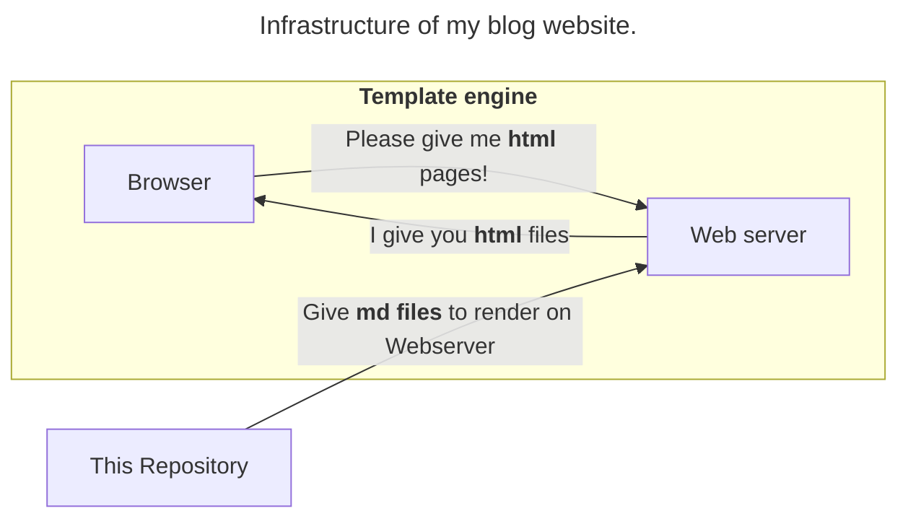

# Markdown blog resources

This is my default Markdown Blog repository.

## why? 

```mermaid
---
title: Infrastructure of my blog website.
---
flowchart LR
    subgraph "`**Template engine**`"
    Browser[Browser] --"`Please give me **html** pages!`"--> 
    Web_server[Web server]
    Web_server --"`I give you **html** files`"--> Browser
    end
        direction TB
        database[This Repository] --"`Give **md files** to render on Webserver`"--> Web_server 

```