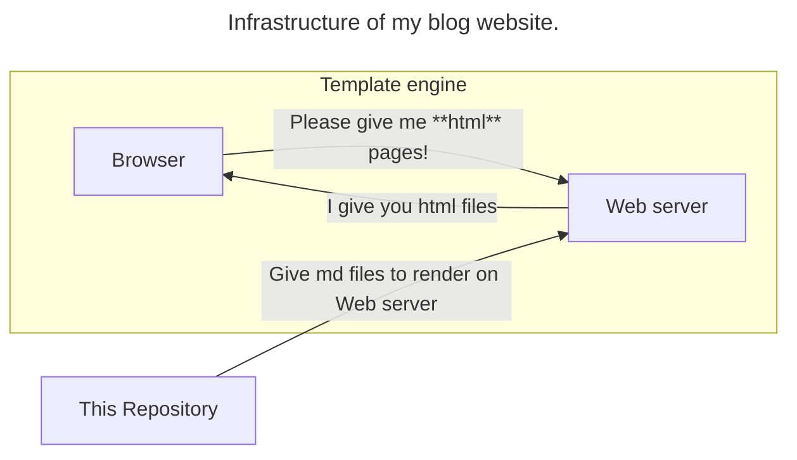
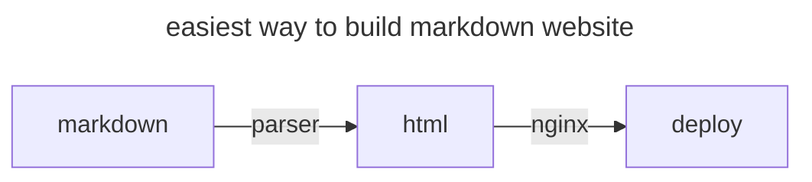
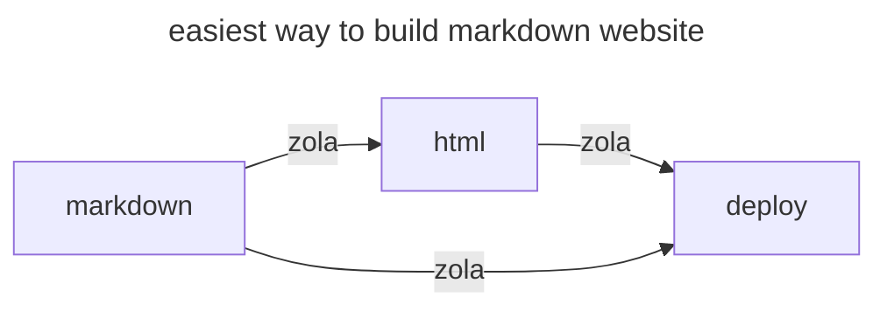

# Markdown blog resources

This is my default Markdown Blog repository.

## Why? 

Modern blogging platforms like *Gatsby* or *Jekyll* offer visually appealing and simple designs for Markdown blogs. However, these platforms come with certain limitations. Firstly, they require a significant number of dependencies, which can slow down the blog and complicate maintenance. Secondly, the tools and frameworks in this domain are constantly evolving, making it challenging to keep up with the latest changes.

To illustrate this point, let's examine the evolution of John Gruber's blog, who is renowned for creating the Markdown format. Comparing the design of his blog from 2002 to its 2023 version, we observe minimal changes. This consistency underscores a critical insight: the value of a blog lies more in its content than in its aesthetic presentation.

In light of this, when considering the development of a personal blog, the focus should be on substance rather than style. With this in mind, the following requirements emerge for the creation of an effective blog:

1. **Minimalism:** The blog should be as minimalistic as possible in terms of design and functionality. This approach ensures faster load times and ease of maintenance.
2. **Customization:** There should be a provision for a personalized template that aligns with the individual's unique preferences and requirements.
3. **Independence:** The tools and programs used for the blog should be self-selected and not dictated by external platforms or trends.

In conclusion, while modern blogging platforms offer convenience and aesthetic appeal, a more tailored approach that prioritizes content and simplicity can yield a more effective and personal blogging experience.

## How?

There are three options, that I can apply for my Blog. 
- [Hugo](https://gohugo.io/) : Go
- [Zola](https://www.getzola.org/) : Rust
- [jinja](https://jinja.palletsprojects.com/en/3.1.x/) : python

I like Zola with its nice explained Documentations and Conciseness.
I think the easiest way to build markdown website is so.

Zola is used for this achitecture.

Someday I will write my own minimal Template engine for my blog. 